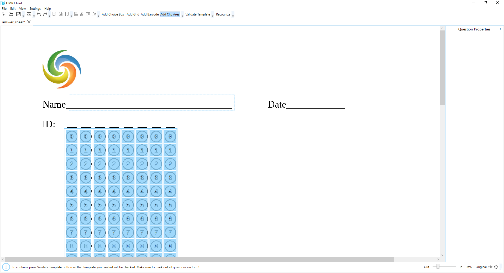
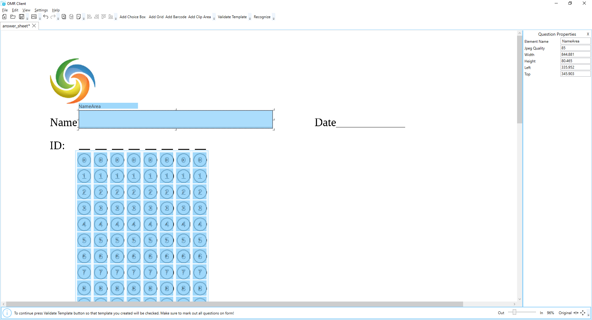

## **Description**
Users can specify areas of interest, which will be cropped from the recognized image and returned as a separate images in recognition response. In this way, user can obtain not only the recognition data, but also the cropped parts of the original image that may be further processed according to user needs.
## **Specification**
#### **Element description**
In order to provide clipping areas we introduce new markup element **AreaOfInterest** that looks like this:

```html

{

  "Type": "ClipArea",

  "Name": "NameArea",

  "JpegQuality": 85,

  "Width": 126,

  "Height": 61,

  "Top": 530,

  "Left": 327

}

```

Clip area will be stored as JPEG image, default JPEG quality is 85. You may change this property, but it is recommended to set value between 30 and 99 (still, any number between 0 and 100 is acceptable).

Please keep in mind that clip areas are cropped from the images that are sent to the recognition and might be preprocessed and compressed according to the preprocessing settings. This may affect the final quality of clipped images.

This AreaOfInterest element is added along with the other elements in the template description file (.omr), which is processed during template correction. Actual request content, including validation and recognition has no changes.
#### **Response**
We provide clipped images for each recognized image in the recognition response.

Now we include all clipped areas as a part of ResponseFiles json array:

**Updated Response**

```html

{

  "ResponseFiles": [

    {

      "Name": "RecognitionResults.dat",

      "Size": 121,

      "Data": "UXVlc3R.....24xMDpDCg=="

    },

    {

      "Name": "Paper1NameArea.png",

      "Size": 35437,

      "Data": "iVBORw0KGg.....5ErkJggg=="

    }

  ]

}

```

Name of the clipped area image is combined in the following way: **"<image_name>+<name_of_the_element>.png"**. In the example above, "Paper1" is a name of recognized image, "NameArea" is the name of an element.

Image data is encoded as base64 string.
## **How to use in Client**
Clip Area is a new element that can be added during template creation. In order to add Clip Area to the template click Clip Area on toolbar and choose location of the element. Make sure to properly name the element. Another property is JPEG quality, as clip area will be stored as JPEG image. Default JPEG quality is 85, but you can choose any between 0 and 100.






Then, during Recognition stage, specified areas will be clipped from all processed images. List of these areas can be seen in the bottom right corner under the answers table. Each item can be reviewed by clicking the preview button. That will display clipped image in a separate view allowing you to save this area to the desired location.


