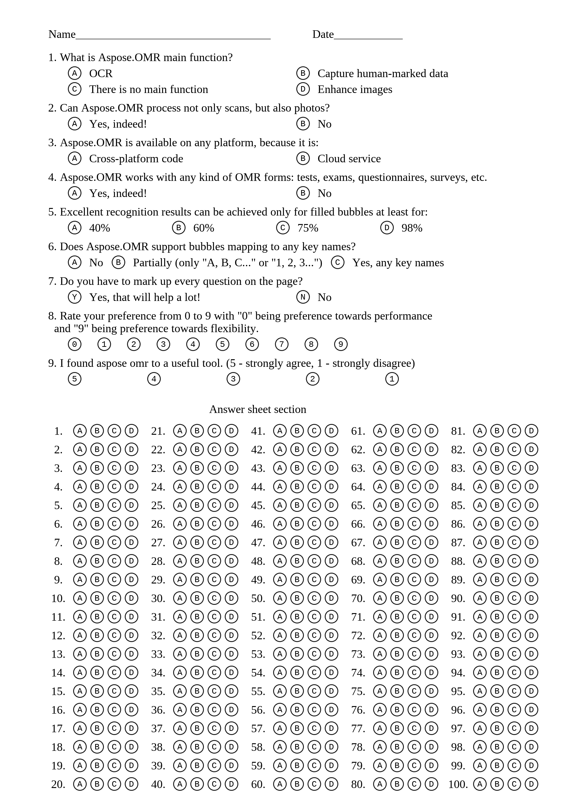
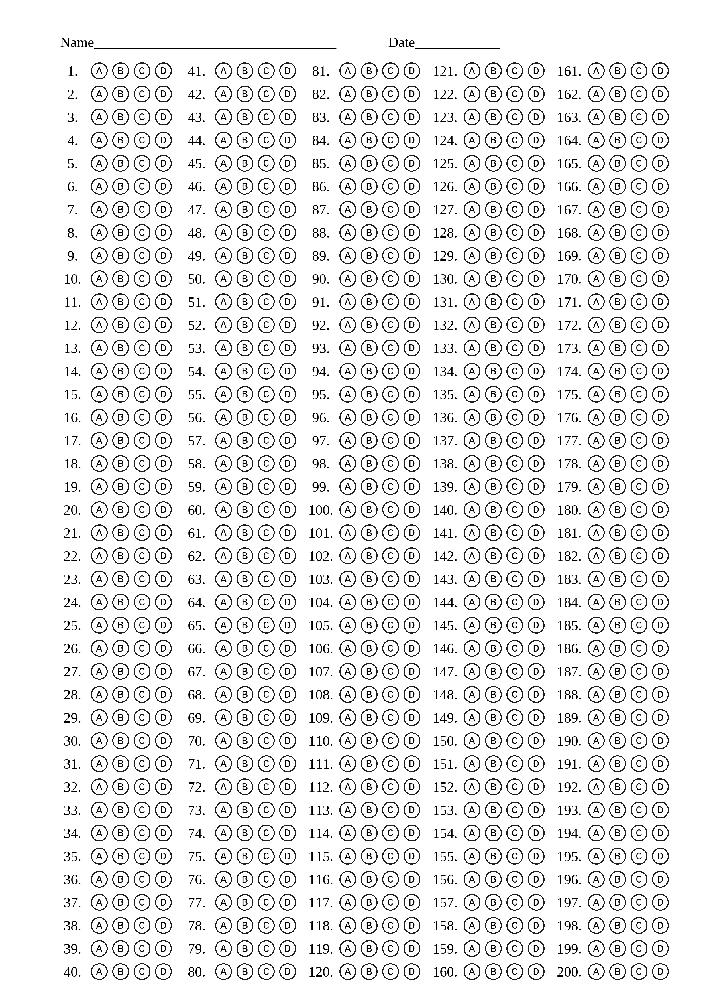
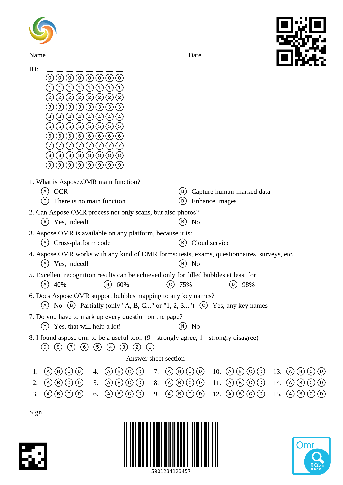

Aspose template generation API allows you to generate surveys and test sheets through simple text mark-up. Just prepare the survey text and you have a template ready to work with. Alternatively, you can write a header text, specify number of questions and answers… Congratulations! You get your personal test sheet.








Mark-up for generation supports several types of elements:

- Text. The element description starts with <**?text=**> prefix and could be continued with any number of lines not started with <**\t**> symbol (tabulation)
- ChoiceBox (Question). The element description starts either with symbol <**#**> or <**\***>. Then you should continue it with a question and answers. Any answer starts with parentheses with an answer name or a letter incide, e.g. <**(A)**> proceeded with the answer text.
  Choosing <**#**> means the interviewee can only choose one answer. Respectively, <**\***> means that interviewee can choose several answers.
- Answer sheet (several columns of questions). The element description starts with the

<**?answer_sheet=**> prefix which sets the sheet name. Then you can specify the number of questions using attributes <**elements_count**>, columns <**columns_count**>, <**answers_count>** or <**answers_list**>. The last allows to use custom answers, e.g. "(a) (b) (c) (d)" or "(1) (2) (3) (4) (5)". Also, you might specify question id to start from using property **<start_id>** 

- Grid (complex values that consist of similar sections). The element description starts with <?**grid**=> prefix which sets the grid name. Then you can specify the number of sections <**sections_count**> and <**answers_list**>. Grid allows to extract an ordered list of elements from the table, e.g. phone number, name, ID number and so on. The <**sections_count**> specifies the length of the ordered list. The <**answers_list**> bubbles in the sections of a table
- Image. You can add images, logos for example, in your template, as can be seen on one of the examples. The element description starts with **<?image=>** prefix, and then name of the image should be provided. Additionaly, you can specify image alignment by using <**align=>** tag following with one of the following values: **<left,center,right>**. Default value is **center**.   


- Barcode. Barcodes, QR-codes and Aruco codes can be added onto your template for different purposes (QR-code with a link, barcode for a unique student ID, etc.). The element description starts with **<?barcode=>** prefix, where you have to provide the name of the barcode (e.g. "Student_ID" or "AsposeWebsite"). Next, attributes follow: **<value>**  for the value that the barcode encodes, **<barcode_type>** for the type of barcode (currently supported types are ['code39', 'ean', 'ean13', 'ean8', 'qr', 'aruco', 'jan', 'upc', 'upca']), optional **<qr_version>** for QR-codes (values from 1 to 40, defaults to 1), **<x>** and **<y>** for custom top-left corner coordinates, and **<height>** to set the height of the barcode (width will adjust accordingly). **NB**: height is an approximate attribute, as barcodes must not be distorted by any kinds of interpolation, so the real height might be lower in order for barcodes to be rendered correctly.

All elements attributes names are preceded by < **\t** > symbol (tabulation)

```java
?text=Name__________________________________              Date____________


#What is Aspose.OMR main function?
    () OCR () Capture human-marked data
    () There is no main function () Enhance images
#Can Aspose.OMR process not only scans, but also photos?
    () Yes, indeed! () No
#Aspose.OMR is available on any platform, because it is:
    () Cross-platform code () Cloud service
#Aspose.OMR works with any kind of OMR forms: tests, exams, questionnaires, surveys, etc.
    () Yes, indeed! () No
#Excellent recognition results can be achieved only for filled bubbles at least for:
    () 40% () 60% () 75% () 98%
#Does Aspose.OMR support bubbles mapping to any key names?
    () No () Partially (only "A, B, C..." or "1, 2, 3...") () Yes, any key names
#Do you have to mark up every question on the page?
    (Yes) Yes, that will help a lot! (No) No
#Rate your preference from 0 to 9 with "0" being preference towards performance
  and "9" being preference towards flexibility.
    (0) (1) (2) (3) (4) (5) (6) (7) (8) (9)
#I found aspose omr to be a useful tool. (5 - strongly agree, 1 - strongly disagree)
    (5) (4) (3) (2) (1)

?text=                        Answer sheet section

?answer_sheet=MainQuestions
    elements_count=100
    columns_count=5
```

```java
?text=Name__________________________________              Date____________

?answer_sheet=MainQuestions
    elements_count=200
    columns_count=5
 
 ```
 ```java
 
?image=Aspose.jpg
align=left

?text=Name__________________________________ Date____________

?grid=ID
sections_count=8

#What is Aspose.OMR main function?
() OCR () Capture human-marked data
() There is no main function () Enhance images
#Can Aspose.OMR process not only scans, but also photos?
() Yes, indeed! () No
#Aspose.OMR is available on any platform, because it is:
() Cross-platform code () Cloud service
#Aspose.OMR works with any kind of OMR forms: tests, exams, questionnaires, surveys, etc.
() Yes, indeed! () No
#Excellent recognition results can be achieved only for filled bubbles at least for:
() 40% () 60% () 75% () 98%
#Does Aspose.OMR support bubbles mapping to any key names?
() No () Partially (only "A, B, C..." or "1, 2, 3...") () Yes, any key names
#Do you have to mark up every question on the page?
(Yes) Yes, that will help a lot! (No) No
#Rate your preference from 0 to 9 with "0" being preference towards performance
and "9" being preference towards flexibility.
(0) (1) (2) (3) (4) (5) (6) (7) (8) (9)
#I found aspose omr to be a useful tool. (5 - strongly agree, 1 - strongly disagree)
(5) (4) (3) (2) (1)

?text= Answer sheet section
?answer_sheet=MainQuestions
elements_count=10
columns_count=5
?text=Sign________________________________


?image=aspose_omr_logo5.png
    align=right
?barcode=Student_ID
    value=5901234123457
    barcode_type=ean13
    x=900
    y=3050
    height=400
?barcode=AsposeWebsite
    value=aspose.com
    barcode_type=qr
    qr_version=1
    x=2000
    y=120
    height=360
?barcode=ArucoTest
    value=53
    barcode_type=aruco
    x=140
    y=3200
    height=198


